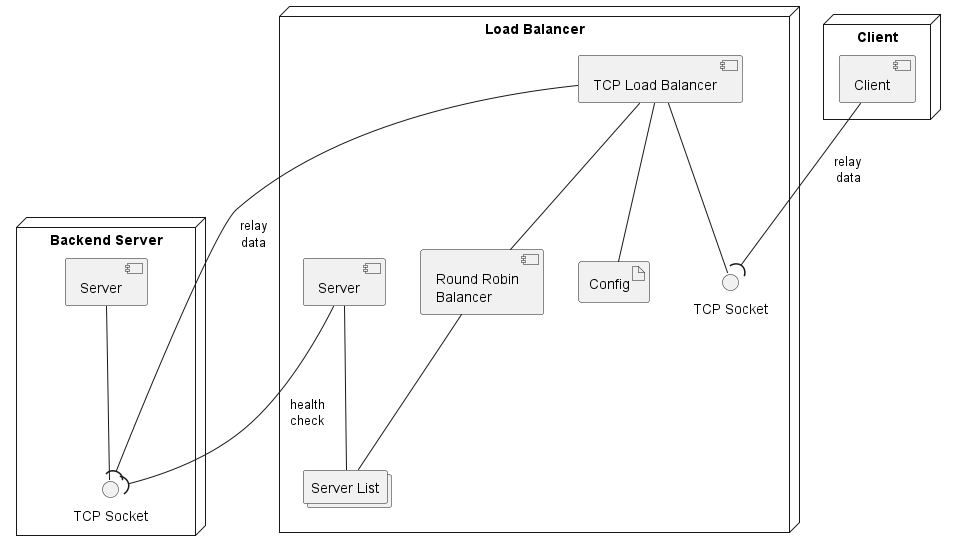

# Loadbalancer - Golang or Ruby?

The project is implemented in both Golang and Ruby in order to learn and compare both languages. The focus is on the networking aspects of these languages. Therefore, a load balancer was chosen as an example.

## About

This project consists of a load balancer application that distributes TCP connections across multiple backend servers. The load balancer is designed to improve the availability and reliability of your services by distributing the load evenly among multiple backend servers. It also includes health checks and handles connection failovers to ensure reliable and error-free connections.

The project includes the following components:

- **Client**: A client application that sends requests to the load balancer to simulate traffic.
- **Load Balancer:** The core component that distributes traffic among backend servers. It supports round robin load balancing, performs periodic health checks on the backend servers and handles connection failovers in case of a faulty backend server
- **Backend Server:** Simulated backend servers that handle incoming requests. These servers can be scaled up or down to test the load balancer's functionality.

The following diagramm depicts how the system interacts:



More details about the contents of the Load Balancer can be found in the README.md files of the Golang and Ruby Loadbalancer. They are covered separately there.


## Project Layout

The project is organized into two main directories:
- `go/`
- `ruby/`

Each directory contains the implementation of the project's components in its respective language. Inside each folder resides:

- a `client/` directory: Contains a client application to simulate tcp traffic
- a `loadbalancer/` directory: Contains the load balancer
- a `server/` directory: Contains a simulated backend server
- a `docker-compose.yml` to quickly set up a complete test scenario via docker compose.

## Getting Started

If you are interested in contributing or running the code locally, follow the instructions in the README.md files in each component's directory. These instructions will guide you through setting up your local environment or setting up individual Docker containers.

If you are only interested in testing a complete Golang or Ruby load balancer scenario, you can simply run one of the docker-compose.yml files provided. To do this, run the following statements:

```sh
# check if you have a working docker and docker-compose installation
# if you run into problems, check the setup section
docker --version
docker-compose --version

# switch into a working direcotry that contains a docker-compose.yml file
# there are default docker-compose scenarios in the .\ruby\ and .\go\ directories
cd .\ruby\

# run docker-compose
docker-compose up
```

Feel free to temper with any provided Docker Compose scenario to get a better test scenario tailored to your specific needs

### Requirements

- Docker
- Docker Compose
- Go (for Go components)
- Ruby (for Ruby components)

You can quickly set up Docker and Docker Compose by running these commands:
```sh
# On Ubuntu:
sudo apt install docker-ce
sudo apt install docker-ce-cli
sudo apt install docker-compose-plugin
```

If you need to set up Golang or Ruby, choose the component you want to have closer look into and read it's respective README.md file. you will find further details there.

## References

this section contains important reference points that were helpful while implementing this project

### Golang

- basics about Golang: https://github.com/s-macke/concepts-of-programming-languages 
- interactive tour of go: https://go.dev/tour/welcome/1 
- for command line parsing in golang: https://pkg.go.dev/flag 
- for network I/O, including TCP/IP: https://pkg.go.dev/net
- for cancellation signals across goroutines: https://pkg.go.dev/context 

### Ruby

- basics about Ruby: https://try.ruby-lang.org/
- philosophy of Ruby: https://poignant.guide/book/chapter-1.html 
- introduction into the test ruby framework rspec: https://www.theodinproject.com/lessons/ruby-introduction-to-rspec
- for network I/O, includig TCP/IP: https://docs.ruby-lang.org/en/2.1.0/Socket.html 
- async asynchronous I/O framework using Ruby Reactors: https://www.rubydoc.info/gems/async/1.24.2  
- An introduction into Rubys concurrency model: https://www.honeybadger.io/blog/ractors/ 

