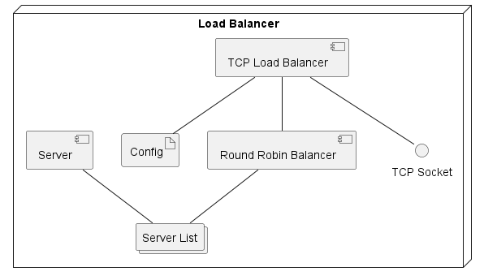

# Golang Load Balancer

A TCP Load Balancer that uses a round robin algorithmus to balance new incoming TCP Connections between multiple backend servers. This Load Balancer is written in Golang

## Components

this diagramm depicts components of the load balancer:


- **Server:** this component defines a backend server struct. It also provides helper functions methods to create a new servers, get its address, and check its health status by attempting a TCP connection within a specified timeout.
- **Server List:** collection of **Server** instances.
- **Config:** a yaml artifact that stores configurations about the load balancer. In the golang load balancer there is an additional struct for reading and parsing the yaml file into this golang struct. There are two provided config files:  `config_local.yaml` for a locally run load balancer and `config_compose.yaml` for a docker compose test scenario.
- **Round Robin Balancer:** This component manages a list of backend servers and returns servers using a round robin algorithm
- **TCP Load Balancer:** manages incoming TCP connections and relays them to a backend server provided by the **Round Robin Balancer**. Additionally, it provides connection failover and orchestrates the load balancers startup and graceful shutdown.
- **TCP Socket:** exposed TCP Socket interface

## Activity diagram concepts

This section provides simplified activity diagrams to assist you in understanding the code flow in the load balancer. The following concepts are illustrated:
- **handle client connection with failover:** shows the process by which the load balancer selects a backend server to connect to. It also shows that different backend servers are retried as a failover
- **relay data between client and backend server** : illustrates how data is passed between client and backend server using waiting groups that make sure the data is completly transmited
  


## Requirements

To run this application, you need to have Golang and Docker installed on your system. You can check whether you have the necessary installations by executing these statements:
```sh
## Verify your Docker installation
docker --version
## Verify your Golang installation
go version
```

You can install the requirements by executing the following commands (on Ubuntu OS):
```sh
sudo apt install docker-ce
sudo apt install docker-ce-cli
sudo apt install golang-go
```

## Run with Docker

first you need to build the docker container.
This command builds the docker image with the tag `go-loadbalancer`.
```sh
docker build -t go-loadbalancer .
```

Afterwards you can run the Docker container like this.
```sh
docker run go-loadbalancer
```

If you want to override the arguments to the `go-loadbalancer` executeable, you can do it this way:
```sh
docker run go-loadbalancer ./go-loadbalancer "-config" "config_local.yaml"
```

## Run locally

install golang and verify the installation (use a package manager depending on your OS):
```sh
sudo apt install golang-go
go version
```

to install needed packages execute this statement inside the folder:
```sh
go mod tidy
```

build the project in the current folder:
```sh
go build
```

Run the executable. Additionally, you can fill in the arguments `<config_file_name>` with the name of the config file that the application will use. The config file must reside inside the application folder. The default config used is "config_local.yaml".
```sh
./go-loadbalancer -config <config_file_name>
```

## Execute tests

To execute the tests for this Golang project, you can use the built-in testing tool provided by Golang. Run the following command to execute all tests in this directory:
```sh
go test
```

