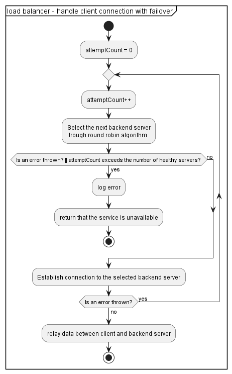
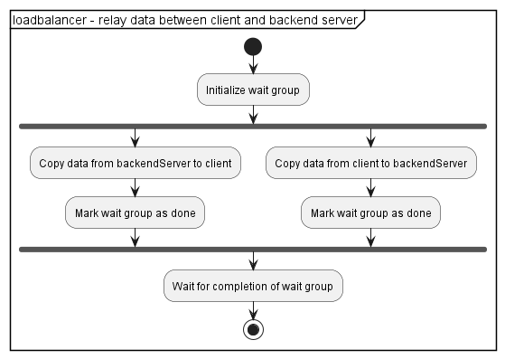

# Ruby Load Balancer

A TCP Load Balancer that uses a round robin algorithmus to balance new incoming TCP Connections between multiple backend servers. This Load Balancer is written in Ruby.

## Components

this diagram depicts components of the load balancer:


- **Server:** this component defines a backend server struct. It also provides helper functions methods to create a new servers, get its address, and check its health status by attempting a TCP connection within a specified timeout.
- **Server List:** collection of **Server** instances.
- **Config:** a yaml artifact that stores configurations about the load balancer. There are two provided config files:  `config_local.yaml` for a locally run load balancer and `config_compose.yaml` for a docker compose test scenario.
- **Round Robin Balancer:** This component manages a list of backend servers and returns servers using a round robin algorithm
- **TCP Load Balancer:** manages incoming TCP connections and relays them to a backend server provided by the **Round Robin Balancer**. Additionally, it provides connection failover and orchestrates the load balancers startup and graceful shutdown.
- **TCP Socket:** exposed TCP Socket interface

## Activity diagram concepts

This section provides activity diagrams to assist you in understanding the code flow in the load balancer. Beware, that these activity diagrams are simplified. Error handling, threading and other complexities are often hidden inside action blocks or excluded altogether. 

following concepts are illustrated:
- **load balancer initialization:** shows how the load balancer is constructed
- **load balancer start:** depicts how the load balancer starts 
- **handle client connection with failover:** shows the process by which the load balancer selects a backend server to connect to. It also shows that different backend servers are retried as a failover
- **relay data between client and backend server** : illustrates how data is passed between client and backend server using waiting groups that make sure the data is completly transmited
- **load balancer stop:** depicts how the load balancer is gracefully stops







## Requirements

To run this application, you need to have Ruby and Docker installed on your system. You can check whether you have the necessary installations by executing these statements:
```sh
## Verify your Docker installation
docker --version
## Verify your Ruby installation
ruby -v
```

You can install the requirements by executing the following commands (on Ubuntu OS):
```sh
sudo apt install docker-ce
sudo apt install docker-ce-cli
sudo apt install ruby-full
```

## Run with Docker

first you need to build the docker container.
This command builds the docker image with the tag `ruby-loadbalancer`.
```sh
docker build -t ruby-loadbalancer .
```

Afterwards you can run the Docker container like this.
```sh
docker run -p 8080:8080 ruby-loadbalancer
```

If you want to override the arguments to the `start_loadbalancer.rb` script, you can do it this way:
```sh
docker run -p 8080:8080 ruby-loadbalancer ruby start_loadbalancer.rb config_local.yaml
```

## Run locally

install ruby and verify the installation (use a package manager depending on your OS):
```sh
sudo apt install ruby-full
ruby -v
```

to install needed gems execute this statement inside the folder:
```sh
bundle install
```

run this command in this folder; Optional you can fill in the name of a different config file for the loadbalancer in the argument `<optional:config_file>`. Make sure the used config file resides inside the application folder:
```sh
ruby start_loadbalancer.rb <optional:config_file>
```

## Execute tests

To execute the tests for this Ruby project, you can use the RSpec testing tool. Run the following command to execute all tests in this directory:
```sh
rspec .\spec\
```
